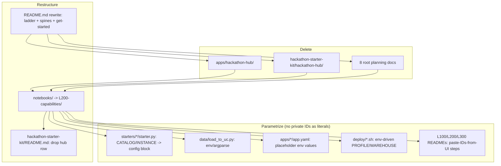

# refactor: Restructure workshop into L100/L200/L300 ladder, remove hub, parametrize for any workspace

## Summary

Re-shape `agent-bricks-workshop` to match the reference repo (`Praneeth16/akzonobel-agentbricks-workshop`). Remove both event-hub copies and all "Hackathon-in-the-Box" branding, restructure the repo into an L100/L200/L300 tier ladder, rewrite the root `README.md` to the reference shape **first**, refresh the starter-kit README now that the hub is gone, and parametrize every notebook, starter, and app so an attendee runs the workshop in their own Databricks workspace with no hardcoded catalog, warehouse, workspace host, profile, or Genie-space identifiers. Delete the root internal planning docs.

The synthetic coatings data, the five demo apps, the eight starters, the eval sets, and the Genie/data setup all stay. Only their hardcoded identifiers change, and `notebooks/` is renamed to `L200-capabilities/`. L300 is README-level only: it points at the existing supervisor materials (`apps/supervisor/`, `starters/supervisor/`, the supervisor chapter) without moving files.

---

## Problem Frame

The previous workshop experiment failed (apps would not build, hub deploy crashes). This repo is the clean restart. Today the repo is organized around a single "Hackathon-in-the-Box" hub app that ties everything together — but that hub is being abandoned, it exists in two duplicated copies (`apps/hackathon-hub/` and `hackathon-starter-kit/hackathon-hub/`), and the whole repo is wired to one private workspace (`fevm-serverless-lakebase-praneeth`, catalog `serverless_lakebase_praneeth_catalog`, warehouse `4d39ac2e32b72a3a`, profile `fe-vm-lakebase-praneeth`). An attendee cloning this cannot run it.

The reference repo solves this with a clean progressive-tier framing: L100 Foundations → L200 Capabilities → L300 Use case → hackathon kit, where each tier is self-contained and every surface reads its workspace config from widgets/env rather than baked-in IDs.

**Goal:** any attendee clones the repo into their own Databricks Git folder, runs the shared data setup once, and climbs the ladder — nothing tied to one workspace.

---

## Scope Boundaries

**In scope**
- Delete `apps/hackathon-hub/` and `hackathon-starter-kit/hackathon-hub/` entirely.
- Scrub all "Hackathon-in-the-Box / hackathon-hub / the hub / event hub / AppKit hub" references from surviving files.
- Rename `notebooks/` → `L200-capabilities/`; update all surviving cross-references.
- Rewrite root `README.md` to the reference shape.
- Update `hackathon-starter-kit/README.md` (hub row removed, kit catalog stays).
- Parametrize: starters, `data/load_to_uc.py`, app `app.yaml` files, deploy scripts, and add "paste your IDs from the UI" steps into the L100/L200/L300 folder READMEs.
- Delete root planning docs: `BUILD_PLAN.md`, `AKZONOBEL_DEMO_PLAN.md`, `AKZONOBEL_WORKSHOP_PLAN.md`, `HACKATHON_IN_A_BOX_PLAN.md`, `WORKSHOP_AGENDA.md`, `WORKSHOP_MATERIALS.md`, `VIBE_CODING_SESSION.md`, `AGENTS_THAT_ACT_PLAN.md`.

**Out of scope / non-goals**
- No file moves for L300 — README references the existing supervisor materials in place (user decision).
- No restructure of `data/`, `genie/`, `eval/`, `demo/`, `starters/` folder layouts (only their hardcoded IDs change).
- No code changes to app business logic, agent prompts, or frontends beyond config parametrization.
- Not fixing the original app build/deploy crashes — separate concern.
- `docs/plans/` (internal ce-plan history) is left as-is; stale cross-refs there are historical and not attendee-facing.

### Deferred to Follow-Up Work
- Reconciling the duplication between top-level `starters/` and `hackathon-starter-kit/tracks/` (both describe forkable tracks). Out of this cleanup's confirmed scope.
- Replacing the hardcoded mock-systems app URL with a deploy-time-derived host (currently env-overridable with a workshop default — acceptable).

---

## The Reference Structure (target)

The root README mirrors the reference repo:

| Tier | Folder | You build |
|---|---|---|
| L100 Foundations | `L100-foundations/` | AI from SQL, no-code Agent Bricks types, first coded agent, evaluation, memory |
| L200 Capabilities | `L200-capabilities/` | Tool calling, an MCP server you build, Lakebase memory, deployment, first agent that acts behind a human approval gate |
| L300 Use case | references `apps/supervisor/` + `starters/supervisor/` + the supervisor chapter | Flagship multi-domain supervisor across Finance/SCM/Commercial with the full action ladder |
| Hackathon kit | `hackathon-starter-kit/` | Forkable tracks, starter prompts, ai-dev-kit skills |

Plus the three spines table (Agent Bricks types / MCP / Agents that act / LLMOps across L100→L300), a "Get started" section using the Databricks Git-folder clone flow, prerequisites, and a "What's included" table.

---

## Key Technical Decisions

**KTD1 — Parametrize to the L100 widget pattern, defaults that self-discover.** Notebooks and starters read config from `dbutils.widgets` (notebooks) or a top-of-file config block (starters). The catalog default is `spark.sql("SELECT current_catalog()").first()[0]` (already proven in `L100-foundations/00_sql_ai_functions.ipynb`), so on Vocareum/any lab it defaults to the attendee's assigned catalog. No hardcoded `serverless_lakebase_praneeth_catalog` remains as a literal default in any surviving notebook/starter.

**KTD2 — Genie space IDs become required widgets with a documented UI step.** The catalog cannot self-discover Genie space IDs. The supervisor chapter (`L200-capabilities/01_governed_supervisor.py`) already exposes them as widgets — keep that, but blank the workshop-specific hex defaults and add a numbered "Create the three Genie spaces, then paste their IDs from the Genie UI URL into these widgets" step into the relevant folder README(s). Same approach wherever space IDs are consumed.

**KTD3 — Apps stay env-var driven; remove hardcoded fallbacks from `app.yaml`.** App Python (`databricks_client.py`, `lakebase.py`, `_http.py`) already reads `os.environ.get(...)` with a workshop default. Per the "no hardcoded fallbacks" instruction, change the `app.yaml` `env:` blocks so warehouse/lakebase/endpoint values are placeholders the attendee fills (e.g. `<your-warehouse-id>`), and document them in each app README + `.env.example`. The Python defaults are kept only as a last-resort and pointed at a clearly-placeholder value, not the private workspace ID.

**KTD4 — Deploy scripts and `data/load_to_uc.py` read profile/warehouse/catalog from env or CLI args.** Replace the hardcoded `PROFILE=` / `WAREHOUSE_ID=` / `CATALOG=` assignments with `${VAR:-<placeholder>}` env reads (scripts) and `os.environ.get(...)` / argparse (Python), so no private IDs ship as literals.

**KTD5 — L300 is documentation-only.** No `L300-usecase/` folder is created. The README L300 row and a short "L300 — Use case" README section point at the in-place supervisor materials. Lowest churn, honors the user decision.

**KTD6 — README first, then the structural changes.** Per explicit user instruction, U1 (README rewrite) lands before the deletions/rename/parametrization so the entry point is correct from the first commit. The README is written to describe the target structure; subsequent units make the repo match it.

---

## High-Level Technical Design

Sequencing rationale: README first (U1), then deletes (U2-U3) shrink the cross-ref surface, then the rename (U4) so path updates touch the smallest set, then parametrization (U5-U8), then a final sweep (U9) verifies no private IDs or hub references survive.

---

## Implementation Units

### U1. Rewrite root README.md to the reference shape

**Goal:** Replace the hub-centric README with the reference repo's tier-ladder README. This lands first so the repo's entry point is correct before any structural change.

**Dependencies:** none.

**Files:**
- `README.md` (rewrite)

**Approach:**
- Mirror the reference README sections: title + tagline, "What this is", "The ladder" table (L100 / L200 / L300 / hackathon kit), "The three spines" table, "Get started" (Databricks Git-folder clone — UI Option A + CLI Option B, Vocareum note), "Prerequisites", "What's included" table, synthetic-data note.
- The ladder/what's-included tables reference the **target** paths: `L200-capabilities/` (not `notebooks/`), `L100-foundations/`, `hackathon-starter-kit/`, `data/`. L300 row references `apps/supervisor/` + `starters/supervisor/` in place.
- No live-hub badge, no `apps/hackathon-hub` paths, no private workspace host in the clone URL (use the public GitHub repo URL `https://github.com/Praneeth16/akzo-agent-bricks-workshop.git` form, or a `<your-fork>` placeholder).
- Remove the "Workspace" table of private IDs and the "Deploy gotchas" hub section; replace deploy guidance with a generic "pass your catalog at deploy time and grant the app SP access" line.
- Keep the synthetic-data disclaimer.

**Patterns to follow:** the fetched reference README structure (ladder + spines + get-started/Git-folder + prerequisites + what's-included).

**Test scenarios:** Test expectation: none — documentation. Verification below.

**Verification:** README has no occurrence of `Hackathon-in-the-Box`, `hackathon-hub`, `7474654904882204`, `fevm-serverless-lakebase-praneeth`, `serverless_lakebase_praneeth_catalog`, or `4d39ac2e32b72a3a`. Ladder table lists L100/L200/L300/kit with `L200-capabilities/` path. Renders cleanly as Markdown.

---

### U2. Delete both event-hub copies

**Goal:** Remove the abandoned hub app, both copies.

**Dependencies:** U1 (README no longer links to them).

**Files:**
- `apps/hackathon-hub/` (delete entire directory)
- `hackathon-starter-kit/hackathon-hub/` (delete entire directory)

**Approach:** `git rm -r` both directories. These hold the bulk of the `notebooks/`-path and deleted-doc cross-references, so deleting them first collapses the later cross-ref surface.

**Test scenarios:** Test expectation: none — deletion. Verification below.

**Verification:** Neither path exists. `apps/` retains `finance-copilot`, `supervisor`, `action-center`, `quote-agent`, `mock-systems`, `_shared`, and the `*.md` design docs. `hackathon-starter-kit/` retains `README.md`, `TRACK_TEMPLATE.md`, `.claude/`, `starter-prompts/`, `tracks/`.

---

### U3. Delete root internal planning docs

**Goal:** Remove internal planning artifacts so the README is the single entry point.

**Dependencies:** U1.

**Files (delete):**
- `BUILD_PLAN.md`, `AKZONOBEL_DEMO_PLAN.md`, `AKZONOBEL_WORKSHOP_PLAN.md`, `HACKATHON_IN_A_BOX_PLAN.md`, `WORKSHOP_AGENDA.md`, `WORKSHOP_MATERIALS.md`, `VIBE_CODING_SESSION.md`, `AGENTS_THAT_ACT_PLAN.md`

**Approach:** `git rm` each. The surviving cross-references to these docs lived almost entirely in the two hub `content.ts` files (deleted in U2); confirm no surviving non-`docs/plans` file links to them in U9.

**Test scenarios:** Test expectation: none — deletion.

**Verification:** None of the eight files exist at repo root. `git grep` for each filename returns hits only under `docs/plans/` (historical, allowed) or nothing.

---

### U4. Rename notebooks/ → L200-capabilities/ and update cross-references

**Goal:** Adopt the tier-named folder and fix every surviving path reference.

**Dependencies:** U2 (deletes the hub files that held most `notebooks/` refs), U3.

**Files:**
- `notebooks/` → `L200-capabilities/` (`git mv`)
- `databricks.yml` (notebook_task paths: lines ~25, 43, 47, 51, 55, 59, 71, 75 — `./notebooks/XX` → `./L200-capabilities/XX`; also the header comment about the hub bundle)
- `L200-capabilities/01_governed_supervisor.py` (self-reference at line ~63)
- `apps/supervisor/backend/agent.py` (line ~13 comment ref)
- `apps/mock-systems/README.md` (line ~37)
- `deploy/deploy_action_apps.sh` (lines ~17, 157)
- `deploy/job_autonomous_scm.json` (lines ~3, 14)
- `deploy/ACTION_SMOKE_RESULTS.md` (lines ~24, 197)
- `starters/*/starter.py` and `starters/action/README.md` — comment/prompt refs to `notebooks/XX`

**Approach:** `git mv notebooks L200-capabilities`, then `git grep -n 'notebooks/'` across surviving files and rewrite each to `L200-capabilities/`. Skip `docs/plans/` (historical).

**Test scenarios:** Test expectation: none — path rename. Verification below.

**Verification:** `L200-capabilities/` contains `01_governed_supervisor.py` … `07_custom_model_serving.py`. `git grep -n 'notebooks/'` returns hits only under `docs/plans/` or none. `databricks bundle validate` would resolve the new notebook paths (paths exist on disk).

---

### U5. Parametrize starters (CATALOG / INSTANCE_NAME)

**Goal:** Remove hardcoded catalog and Lakebase instance from all eight starters.

**Dependencies:** U4.

**Files:**
- `starters/{finance,scm,commercial,forecast,quote,governance,action,supervisor}/starter.py`
- `starters/*/eval.yaml` (only if a catalog literal appears; otherwise informational)

**Approach:** Replace `CATALOG = "serverless_lakebase_praneeth_catalog"` (line ~31/32) with a self-discovering default: `CATALOG = os.environ.get("AKZO_CATALOG") or spark.sql("SELECT current_catalog()").first()[0]` (or the dbutils-widget form if the starter runs as a notebook). Replace `INSTANCE_NAME = "graphrag-spike"` with `os.environ.get("LAKEBASE_INSTANCE", "<your-lakebase-instance>")`. Update the in-file comment/docstring examples that name the private catalog to use `<catalog>` placeholders. Keep table/schema names (`akzo_finance`, etc.) — those are workshop-fixed.

**Patterns to follow:** `L200-capabilities/01_governed_supervisor.py` widget block; `L100-foundations/00_sql_ai_functions.ipynb` `current_catalog()` default.

**Test scenarios:**
- Each `starter.py` parses (`python -c "import ast; ast.parse(open(p).read())"`) after edit.
- No starter contains the literal `serverless_lakebase_praneeth_catalog`.
- `current_catalog()`-based default present where the starter has a Spark session; env-var default elsewhere.

**Verification:** `git grep -l serverless_lakebase_praneeth_catalog starters/` returns nothing; `git grep -n 'graphrag-spike' starters/` returns only env-var-defaulted lines with a placeholder.

---

### U6. Parametrize data/load_to_uc.py

**Goal:** Remove the hardcoded profile, warehouse, and catalog from the data loader.

**Dependencies:** U4.

**Files:**
- `data/load_to_uc.py`

**Approach:** Replace `PROFILE = "fe-vm-lakebase-praneeth"` → `os.environ.get("DATABRICKS_CONFIG_PROFILE")` (None lets the SDK default chain run); `WAREHOUSE_ID = "4d39ac2e32b72a3a"` → `os.environ.get("DATABRICKS_WAREHOUSE_ID")` with a clear error if unset; `CATALOG = "serverless_lakebase_praneeth_catalog"` → `os.environ.get("AKZO_CATALOG", "<your-catalog>")`. Add a short argparse or env-doc header comment. Surface a friendly message naming the required env vars when missing.

**Test scenarios:**
- `python -c "import ast; ast.parse(...)"` passes.
- Running with no env vars raises a clear "set AKZO_CATALOG / DATABRICKS_WAREHOUSE_ID" message rather than silently using a private ID.
- No private literals remain.

**Verification:** `git grep -n 'fe-vm-lakebase-praneeth\|4d39ac2e32b72a3a\|serverless_lakebase_praneeth_catalog' data/load_to_uc.py` returns nothing.

---

### U7. Parametrize app.yaml files and app READMEs

**Goal:** Remove private IDs from app deployment manifests; document the env vars.

**Dependencies:** U4.

**Files:**
- `apps/{finance-copilot,supervisor,action-center,quote-agent}/app.yaml` (warehouse id line ~16, lakebase line ~20, chat endpoint where present)
- `apps/mock-systems/app.yaml` (lakebase line ~10)
- `apps/{...}/README.md` (document required env vars)
- `apps/*/.env.example` where present (e.g. `apps/supervisor/.env.example`) — ensure placeholders, no private IDs
- `apps/_shared/databricks_client.py` and per-app `databricks_client.py` (line ~23 default), `apps/_shared/lakebase.py` + per-app (line ~27), `_http.py` (line ~48) — change the hardcoded **default** value to a clear placeholder, keep the `os.environ.get` read

**Approach:** In each `app.yaml`, change `env:` values from the private IDs to placeholders (`value: "<your-warehouse-id>"`, `value: "<your-lakebase-instance>"`). In the Python, keep `os.environ.get("DATABRICKS_WAREHOUSE_ID", ...)` but swap the default from `4d39ac2e32b72a3a` to `<your-warehouse-id>` (or empty + explicit check). Document `DATABRICKS_WAREHOUSE_ID`, `LAKEBASE_INSTANCE`, `DATABRICKS_CHAT_ENDPOINT`, `AKZO_MOCK_SYSTEMS_URL` in each app README.

**Test scenarios:**
- Each `app.yaml` parses as valid YAML.
- Each edited `.py` parses.
- No private literal (`4d39ac2e32b72a3a`, `graphrag-spike` as a default that ships as the private value, `7474654904882204` private workspace) remains as a baked default — placeholders or env-required instead.

**Verification:** `git grep -rn '4d39ac2e32b72a3a' apps/` returns nothing; warehouse/lakebase values in `app.yaml` are placeholders; app READMEs list the env vars.

---

### U8. Parametrize deploy scripts + add "paste IDs from UI" steps to tier READMEs

**Goal:** Remove private profile/warehouse from deploy scripts, and add explicit UI steps for Genie space IDs into the L100/L200/L300 folder docs.

**Dependencies:** U4, U7.

**Files:**
- `deploy/deploy_apps.sh`, `deploy/deploy_action_apps.sh`, `deploy/deploy_mock_systems.sh` (PROFILE line ~24)
- `L100-foundations/README.md` (add Genie-space + catalog setup step)
- `L200-capabilities/README.md` (create if absent; add "create Genie spaces, paste IDs into widgets" step for the supervisor chapter; document catalog/lakebase widgets)
- a short `L300` section — placed in the root README (per KTD5) and optionally a one-paragraph note in `apps/supervisor/README.md` pointing back to the ladder

**Approach:**
- Scripts: `PROFILE="${DATABRICKS_CONFIG_PROFILE:-<your-profile>}"`; warehouse refs read env. Add a header comment naming required env vars.
- READMEs: add a numbered "Setup IDs" block: (1) run `data/` setup, (2) create the three Genie spaces (`genie/create_genie_spaces.py` writes `genie/space_ids.json`), (3) open each space in the Genie UI and copy the space id from the URL, (4) paste into the notebook widgets (`finance_space_id`, `scm_space_id`, `commercial_space_id`) / starter config. State this once per tier where IDs are consumed.
- Confirm `L200-capabilities/01_governed_supervisor.py` widget **defaults** for the three space IDs are blanked (empty string) so no private hex ships; the README step tells attendees to fill them.

**Test scenarios:**
- Each `.sh` passes `bash -n` (syntax check).
- Tier READMEs contain an explicit "paste the space id from the Genie UI URL" instruction.
- `01_governed_supervisor.py` has no private hex space-id literal as a widget default.

**Verification:** `git grep -rn 'fe-vm-lakebase-praneeth' deploy/` returns nothing (or only `${...:-<placeholder>}` forms); `git grep -n '01f173afe' L200-capabilities/` returns nothing.

---

### U9. Final sweep — scrub remaining hub branding and verify no private IDs survive

**Goal:** Catch every residual "hub" reference and any private identifier across all surviving files.

**Dependencies:** U1–U8.

**Files:**
- `hackathon-starter-kit/README.md` (remove the `hackathon-hub/` table row and "event hub app" line)
- `hackathon-starter-kit/.claude/skills/deploy/skill.md` (line ~12 "or AppKit hub submission" → drop)
- `databricks.yml` (header comment scrub — any remaining hub mention)
- any other surviving file surfaced by the grep sweep

**Approach:** Run the sweep greps below across all surviving files (exclude `docs/plans/`, `.git/`, `node_modules/`). For each hit, scrub branding or replace the private ID with a placeholder/env read. This is the catch-all for references the per-unit edits missed.

**Sweep commands (verification):**
- `git grep -ni 'hackathon-in-the-box\|hackathon-hub\|event hub\|appkit hub' -- ':!docs/plans'` → no hits
- `git grep -n 'fevm-serverless-lakebase-praneeth\|fe-vm-lakebase-praneeth\|serverless_lakebase_praneeth_catalog\|4d39ac2e32b72a3a\|7474654904882204\|01f173afe' -- ':!docs/plans'` → only env-var-defaulted placeholders or no hits
- `git grep -rn 'notebooks/' -- ':!docs/plans'` → no hits

**Test scenarios:**
- All three sweep greps return clean (or only justified placeholder/env forms).
- `hackathon-starter-kit/README.md` has no `hackathon-hub` row; the kit catalog (tracks, prompts, skills) is intact.
- Repo still has a coherent top-level layout: `L100-foundations/`, `L200-capabilities/`, `apps/`, `starters/`, `data/`, `genie/`, `eval/`, `demo/`, `deploy/`, `hackathon-starter-kit/`, `docs/`, `README.md`.

**Verification:** All sweeps clean; spot-render `README.md` and `hackathon-starter-kit/README.md`.

---

## Risks & Mitigations

- **Risk: blanking Genie space-id widget defaults breaks a notebook that runs top-to-bottom without attendee input.** Mitigation: the README step makes the paste explicit; the notebook should error clearly ("set finance_space_id") rather than call an empty space. Verify the supervisor chapter surfaces a clear message on empty id.
- **Risk: rename breaks `databricks.yml` job paths silently.** Mitigation: U4 verification resolves every `notebook_task` path against disk; U9 sweep confirms zero `notebooks/` refs.
- **Risk: a private ID hides in a file not covered by per-unit edits.** Mitigation: U9 is a whole-repo grep sweep that is the authoritative gate.
- **Risk: `current_catalog()` default assumes a Spark session exists in starters that run as plain scripts.** Mitigation: U5 uses the widget/Spark form only where a session exists, env-var form otherwise.

---

## Verification Strategy (whole-repo, run after U9)

1. `git grep` sweeps from U9 all return clean.
2. `python -c "import ast"` parse check on every edited `.py`.
3. `bash -n` on every edited `.sh`; YAML parse on every edited `app.yaml` and `databricks.yml`.
4. `L200-capabilities/` exists with all seven chapters; `notebooks/` gone.
5. Both hub dirs and all eight planning docs gone.
6. README renders with the ladder + spines + get-started + what's-included sections and zero private identifiers.

---

## Sources & Research

- Reference README: `https://github.com/Praneeth16/akzonobel-agentbricks-workshop/blob/main/README.md` (fetched — ladder/spines/get-started structure).
- Two Explore-agent sweeps over the repo produced the exact file:line map of hardcoded IDs and hub/`notebooks/` cross-references (consolidated into the per-unit Files lists above).
